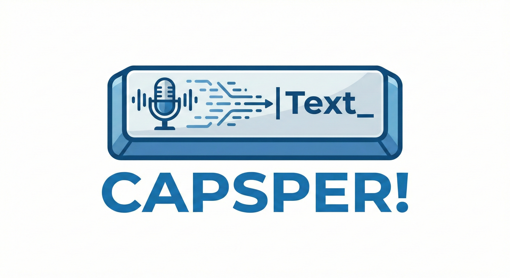

<p align="center">
  
</p>

Does CapsLock annoy you? Ever wished it actually did something useful instead of SHOUTING AT PEOPLE BY ACCIDENT?

Ever wished you could just whisper to a friendly ghost and have your words appear on screen? Well now you can. Capsper is your friendly neighbourhood ghost writer — hold CapsLock, speak, and he types it out for you. No cloud, no subscription, no latency worth complaining about. Just a local GPU, a haunted key, and a little whisper magic.

Push-to-talk voice dictation for Linux. Uses a streaming [whisper.cpp](https://github.com/ggml-org/whisper.cpp) server written in Zig with [AlignAtt](https://aclanthology.org/2023.findings-emnlp.744/) for low-latency transcription. Works on both X11 and Wayland.

## How it works

1. A single Zig binary grabs your keyboard via evdev, intercepts CapsLock as push-to-talk
2. Audio is captured directly via PipeWire while the trigger key is held
3. Incremental transcription runs on the GPU with VAD (Silero, on CPU) and token accumulation for consistency
4. Transcribed text is injected as keystrokes via uinput into the focused window

## Requirements

- Linux (Debian/Ubuntu)
- NVIDIA GPU with ~4 GB VRAM (Turing or newer: GTX 16xx, RTX 20xx/30xx/40xx/50xx)
- CUDA 13 runtime libraries (~600 MB — the installer will set this up for you)
- PipeWire (default audio server on modern Ubuntu/Fedora)

## Install

```bash
mkdir capsper && cd capsper
curl -fSL https://github.com/danielbodart/capsper/releases/latest/download/capsper-linux-x86_64.tar.gz | tar -xz
./install.sh
```

The installer walks you through everything interactively — downloading models (~574 MB), setting up permissions for keyboard grab and text injection, detecting your microphone channel, and installing a systemd user service.

## Usage

```bash
systemctl --user start capsper.service
```

Hold CapsLock and speak. Release to stop. Text appears in the focused window. CapsLock is the default trigger — you can use any key with `--trigger` (see [Server options](#server-options)).

## Auto-updates

Capsper can optionally check for updates daily via a systemd timer (the installer offers to set this up). When a new version is found, it's downloaded and staged in the background. The update is applied automatically on the next service restart — capsper is never interrupted mid-session.

Check for updates manually:

```bash
~/.local/share/capsper/capsper-update.sh
```

Apply a staged update:

```bash
systemctl --user restart capsper.service
```

If a new version crashes repeatedly (3 times within 60 seconds), capsper automatically rolls back to the previous version. You can also roll back manually:

```bash
~/.local/share/capsper/capsper-rollback.sh --force
systemctl --user reset-failed capsper.service
systemctl --user start capsper.service
```

Disable auto-updates:

```bash
systemctl --user disable --now capsper-update.timer
```

### Domain terms

If you frequently use jargon, tool names, or domain-specific vocabulary, you can provide a text file of terms to improve transcription accuracy. The installer can set this up for you, or you can configure it manually:

```bash
capsper --trigger capslock --domain-terms ~/my-terms.txt
```

The terms file is plain text — comma-separated, one per line, or prose. These terms are tokenized and injected into the Whisper decoder as context, biasing it toward your vocabulary without overriding acoustic evidence.

Example `my-terms.txt`:
```
Kubernetes, kubectl, Terraform, Ansible, gRPC, PostgreSQL
```

### PipeWire channel selection

For multi-channel audio interfaces, first list available sources:

```bash
capsper --pw-list
```

Then run interactive channel detection to find which channel carries your microphone signal:

```bash
capsper --pw-detect
# Or target a specific device:
capsper --pw-detect --pw-target alsa_input.usb-Focusrite_Vocaster...
```

This records silence and speech, then shows per-channel signal levels and recommends the correct `--pw-channel` flag.

### Debug recording

To diagnose transcription issues (e.g. dropped words), enable per-utterance recording:

```bash
mkdir /tmp/capsper-debug
capsper --trigger capslock --pw-channel FL --record-dir /tmp/capsper-debug
```

Each utterance produces a pair of files (`000.wav`/`000.log`, `001.wav`/`001.log`, etc.) in a ring buffer — old files are overwritten after `--record-keep` pairs (default 10). The WAV contains the full utterance audio and the log contains emitted text plus a per-cycle diagnostic trace.

Batch-transcribe a captured WAV to compare streaming vs non-streaming results:

```bash
capsper --transcribe /tmp/capsper-debug/005.wav
```

This loads the model, transcribes the entire file in one shot, prints the result, and exits.

## Acknowledgements

Capsper's streaming approach is inspired by [SimulStreaming](https://github.com/ufal/SimulStreaming) (ÚFAL, Charles University), which implements AlignAtt-based simultaneous speech processing and won the IWSLT 2025 Simultaneous Speech Translation Shared Task. We borrowed the core idea of using cross-attention analysis to decide when it's safe to emit partial transcriptions.

Where SimulStreaming targets multilingual translation with Whisper + a 9B-parameter LLM (requiring 10+ GB VRAM and a full Python/PyTorch stack), Capsper takes a different path:

- **Dictation only** — no translation layer, just fast speech-to-text in the focused window
- **~1.7 GB VRAM** vs 5–10+ GB, thanks to a quantised model and no LLM
- **Single Zig binary** — deterministic memory management, no garbage collector, no Python runtime
- **Near-zero idle usage** — no CPU or GPU activity when you're not speaking
- **Direct hardware integration** — evdev keyboard grab, PipeWire audio capture, and uinput text injection with no external tools

## Development

Want to hack on Capsper? You'll need the [requirements](#requirements) above. The Zig binary compiles without CUDA — pre-built whisper.cpp shared libs are committed via Git LFS.

To rebuild the whisper.cpp shared libs (only needed after bumping the submodule), you'll need CUDA toolkit 12.8+ installed. The libs are compiled as PTX (virtual architectures) so no specific GPU hardware is required for compilation — the driver JIT-compiles to the target GPU at first launch.

```bash
git clone --recurse-submodules https://github.com/danielbodart/capsper.git
cd capsper
./run
```

This auto-detects and handles everything:
- Installs toolchain (mise, Zig 0.15.2, Bun) on first run via `bootstrap.sh`
- Installs system packages (`pv`, `ncat`)
- Initialises the whisper.cpp submodule if needed
- Downloads models (~574 MB Whisper model + VAD model) if missing
- Compiles the Zig binary (pre-built whisper.cpp shared libs are committed via Git LFS)
- Runs unit and property tests, then integration smoke tests
- Configures uinput permissions (for text injection via virtual keyboard)
- Creates and enables a systemd user service

Every step is incremental — re-running `./run` is fast if everything is already set up.

## Architecture

```
Physical Keyboard ──evdev──→ capsper ──uinput──→ Virtual Keyboard → Apps
                              │
                              ├─ Trigger key held → PipeWire audio capture
                              ├─ whisper.cpp (GPU) + Silero VAD (CPU)
                              ├─ AlignAtt streaming + token accumulation
                              └─ All other keys → forwarded transparently
```

A single self-contained binary (`src/`):

| File | Purpose |
|---|---|
| `main.zig` | Entry point, argument parsing, model loading, warmup |
| `input.zig` | evdev keyboard grab, uinput virtual keyboard, trigger key + text injection |
| `server.zig` | Streaming state machine, VAD-driven state transitions, word delta emission |
| `pipeline.zig` | Low-level whisper.cpp integration, two-tier token context, mel/encode/decode loop |
| `mel.zig` | Incremental mel spectrogram (FFT, Hann window, mel filterbank with frame caching) |
| `alignatt.zig` | Cross-attention analysis for streaming stop/rewind decisions |
| `recorder.zig` | Per-utterance debug recording (WAV + diagnostic log capture) |
| `utils.zig` | Pure utility functions (PCM conversion, WAV parsing, buffer trimming, RMS analysis) |
| `vad.zig` | Silero VAD wrapper for speech/silence detection |
| `audio_capture.zig` | PipeWire audio capture via `pw_thread_loop` + `pw_stream` |
| `pw_detect.zig` | PipeWire device enumeration and interactive channel detection |
| `pw_helpers.c` | C helpers for PipeWire SPA pod building and source enumeration |

### Technical highlights

**Manual decode loop with cross-attention introspection** — Instead of using whisper.cpp's high-level `whisper_full()`, Capsper manually drives the mel spectrogram → encode → decode pipeline token by token. This gives per-token access to the decoder's cross-attention weights, which is how AlignAtt decides when to stop: it watches where each attention head is "looking" in the audio, and stops when attention drifts past the end of the buffer or jumps backwards (a sign of hallucination). The attention values go through z-score normalisation, median filtering, and head averaging before the stopping decision. Cross-attention also provides per-token audio frame positions, which are used for exact token-audio alignment when the sliding window trims audio from the front — instead of estimating how many tokens to demote, the pipeline knows precisely which tokens correspond to trimmed audio. The most-attended frame persists across decode cycles, so backward attention jumps between cycles (not just within a single decode) are also caught as rewind signals.

**N-gram repetition guard** — The decode loop monitors for repeating token patterns (1 to 64 tokens long). If any n-gram repeats 3 times consecutively, the repeated tokens are discarded and decoding stops. This catches both single-token hallucination loops ("the the the...") and longer phrase repetitions that the attention-based stopping might miss.

**Token accumulation with two-tier context** — Rather than re-transcribing the entire audio buffer each cycle and diffing the output, Capsper commits confirmed tokens as a forced decoder prefix. Each cycle, the model is given previously emitted tokens after `[notimestamps]` as forced output — it processes them as its own previous output, building KV cache state, then continues generating from where it left off. This eliminates the instability that comes from re-decoding: the model always sees the same prefix, so it never contradicts what was already emitted.

When the 30-second sliding window trims audio from the front, the corresponding tokens are demoted from forced output to conditioning context. Instead of being deleted (which caused misalignment and hallucination), they move to the `<|startofprev|>` section before `[sot]`, where the model treats them as a hint rather than a constraint. This two-tier approach — forced tokens for audio in the buffer, conditioning tokens for trimmed audio — is inspired by SimulStreaming's token management.

**CPU-only VAD** — Silero voice activity detection runs on the CPU (2 threads, ~5ms per check) while whisper.cpp transcription runs on the GPU. This avoids GPU context switching overhead for the frequent VAD checks (every 0.5–1s) and means VAD has zero impact on transcription throughput.

**Transparent keyboard forwarding** — Rather than intercepting specific keys, Capsper grabs all physical keyboards via `EVIOCGRAB` and creates a uinput virtual keyboard that forwards every event transparently. Only the trigger key (CapsLock) is consumed; all other keys pass through unchanged. This means the grab is invisible to applications while giving Capsper exclusive access to the trigger. The virtual keyboard also handles text injection — transcribed text is emitted as synthetic keystrokes with proper shift-state handling, which works on both X11 and Wayland without any external tools. A panic sequence (Enter+Backspace+Escape simultaneously) ungrab all keyboards as a safety net.

**Incremental mel spectrogram** — Rather than recomputing the full mel spectrogram from scratch each cycle, Capsper caches raw (pre-normalisation) mel frames and only computes FFT for new audio samples. The mel filterbank, Hann window, and FFT are implemented in pure Zig (`mel.zig`), giving full control over the caching boundary. Normalisation is still a full pass each cycle but takes under 1ms. The cache is reset on segment boundaries or buffer trims (clean slate).

## Server options

Running `capsper` with no arguments prints usage and exits.

```
capsper [OPTIONS]

  --model, -m PATH        Whisper model path (default: whisper.cpp/models/ggml-large-v3-turbo-q5_0.bin)
  --vad-model PATH        VAD model path (default: whisper.cpp/models/ggml-silero-v5.1.2.bin)
  --port, -p PORT         TCP port (default: 43007, use 0 for OS-assigned)
  --warmup-file PATH      WAV file for GPU warmup (default: jfk.wav next to binary)
  --no-warmup             Skip warmup inference
  --input tcp|local       Input mode: tcp (socket) or local (PipeWire capture)
  --trigger KEY           Trigger key for push-to-talk (default: capslock)
  --trigger-passthrough   Forward trigger key to OS after interception
  --type-delay MS         Delay between injected keystrokes in ms (default: 12)
  --pw-target NODE        PipeWire capture target node name
  --pw-channel CHANNEL    PipeWire channel: MONO, FL, AUX0-AUX63 (default: FL)
  --domain-terms FILE     Text file of domain terms to bias transcription toward
  --record-dir DIR        Record each utterance to DIR (WAV + diagnostic log)
  --record-keep N         Number of recording pairs to keep (default: 10, ring buffer)
  --transcribe FILE       Batch-transcribe a WAV file (non-streaming) and exit
  --pw-list               List available PipeWire audio sources
  --pw-detect             Interactive channel detection (record silence + speech)
  --detect-duration SECS  Duration per detection phase (default: 5)
  --verbose               Enable verbose logging
  --dry-run               Load models, run warmup, then exit (validates setup)
```

## Building & testing

All commands go through the Bun-based task runner (`run.ts`), which bootstraps its own toolchain via `bootstrap.sh` + mise. See [Development](#development) for first-time setup.

```bash
# Build (default command)
./run.ts build

# Rebuild whisper.cpp shared libs (only needed after bumping submodule)
./run.ts rebuild-whisper

# Unit + property tests (no GPU required)
./run.ts test

# Regression test groups (requires GPU + built binary)
./run.ts short-test               # Short files (<15s) via fast-forward TCP
./run.ts medium-test              # Medium files (15-40s) via fast-forward TCP
./run.ts long-test                # Long files (>60s) via fast-forward TCP

# All integration tests (all groups + PipeWire plumbing)
./run.ts slow-test
```

## Environment variables

| Variable | Default | Description |
|---|---|---|
| `CAPSPER_PW_CHANNEL` | `FL` | PipeWire channel to capture |
| `CAPSPER_PW_TARGET` | *(unset)* | PipeWire node to capture from |

## Performance

On an RTX 5070 Ti with the `large-v3-turbo-q5_0` model:

- Model load: ~1.2s
- Encode: ~113ms per cycle (80% of cycle time — full self-attention, not incrementalisable)
- Mel spectrogram: ~15ms per cycle (incremental, only computes new frames)
- Streaming latency: ~1s between word emissions
- Total cycle: ~140ms

## Troubleshooting

**"No CUDA GPU detected"** — capsper requires a CUDA-capable NVIDIA GPU and won't fall back to CPU. Ensure CUDA 13 runtime libraries are installed (`sudo apt install cuda-cudart-13-1 libcublas-13-1`) and that `nvidia-smi` shows your GPU.

**Server fails to start** — check `/tmp/capsper.log`. Ensure CUDA is installed and GPU has sufficient VRAM.

**"Failed to load model"** — model file not found. Download it:
```bash
cd whisper.cpp/models && ./download-ggml-model.sh large-v3-turbo-q5_0
```

**Cannot open /dev/input** — ensure your user is in the `input` group (`groups` to check, `sudo usermod -aG input $USER` then log out/in).

**Text not being typed** — ensure `/dev/uinput` is accessible. The udev rule should be set up by `./run setup`, or manually: `echo 'KERNEL=="uinput", GROUP="input", MODE="0660"' | sudo tee /etc/udev/rules.d/99-uinput.rules && sudo udevadm control --reload-rules && sudo udevadm trigger /dev/uinput`.

**Keyboard locked up** — press Enter+Backspace+Escape simultaneously to trigger the panic sequence and ungrab all keyboards.

**Build fails** — ensure the whisper.cpp submodule is initialised and Git LFS files are pulled:
```bash
git submodule update --init --recursive
git lfs pull
```

**PipeWire capture fails** — ensure PipeWire is running (`pw-cli info`). Use `capsper --pw-list` to see available sources, and `capsper --pw-detect` to find the correct channel for multi-channel devices.

**Quiet or degraded transcription** — if using a multi-channel audio interface (e.g. Focusrite Vocaster), make sure you're capturing the correct channel (not a MONO downmix). Run `capsper --pw-detect` and set `--pw-channel` accordingly.
