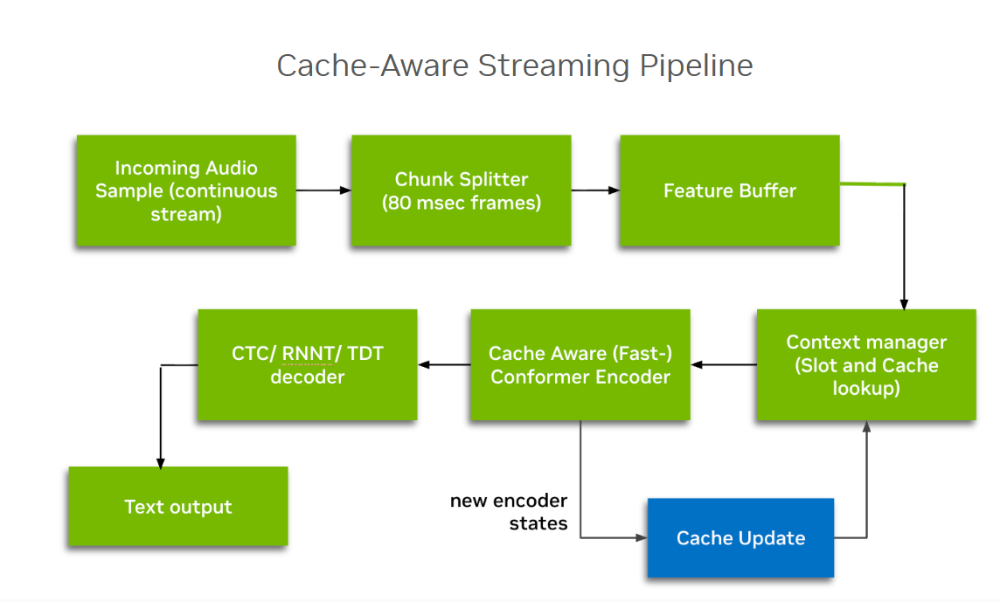
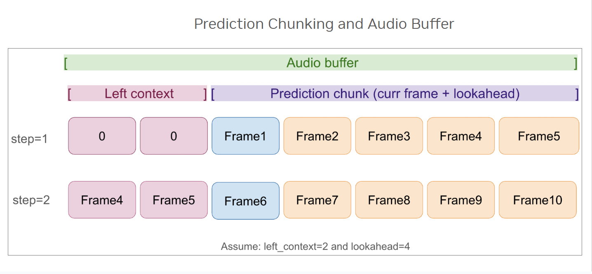
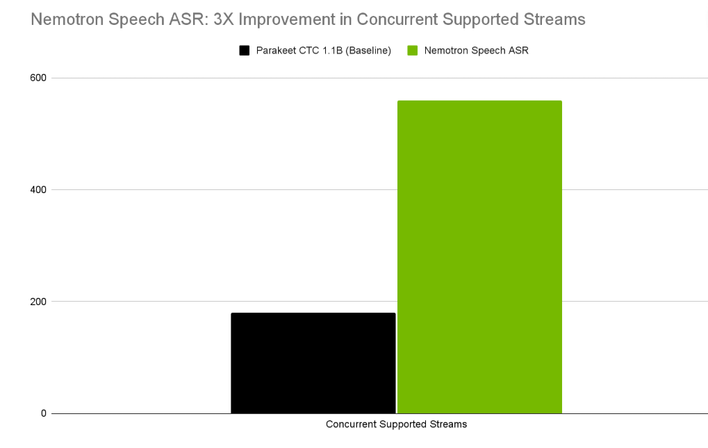
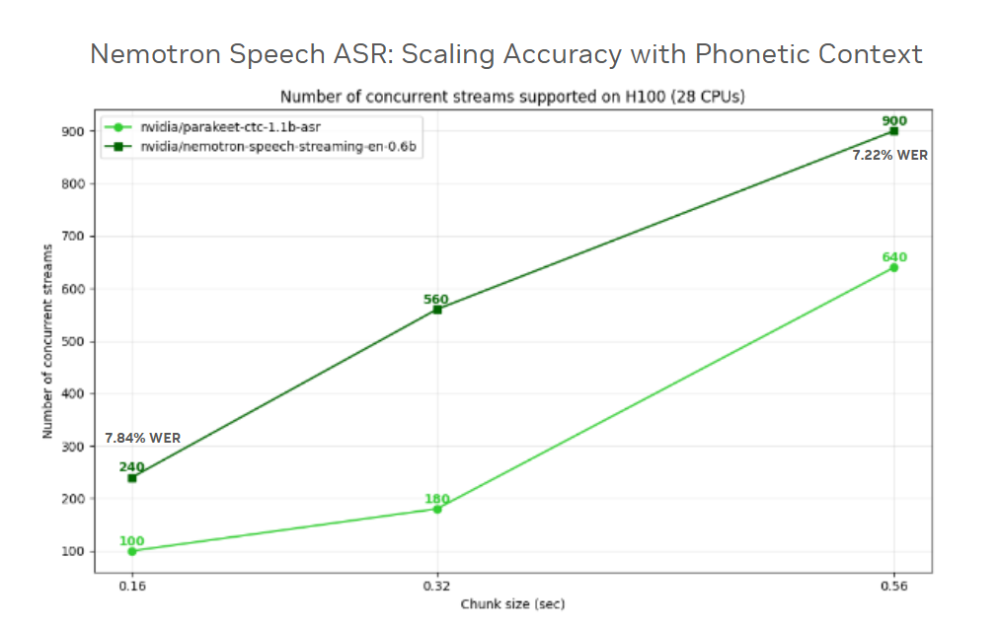
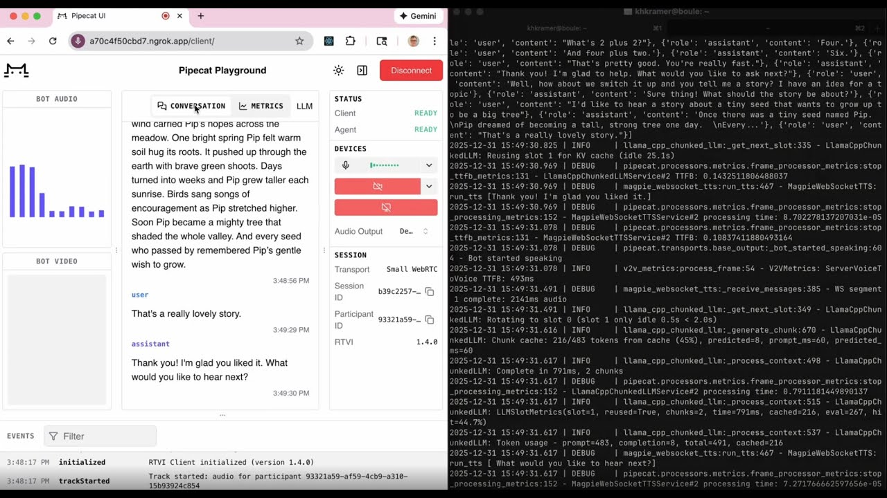
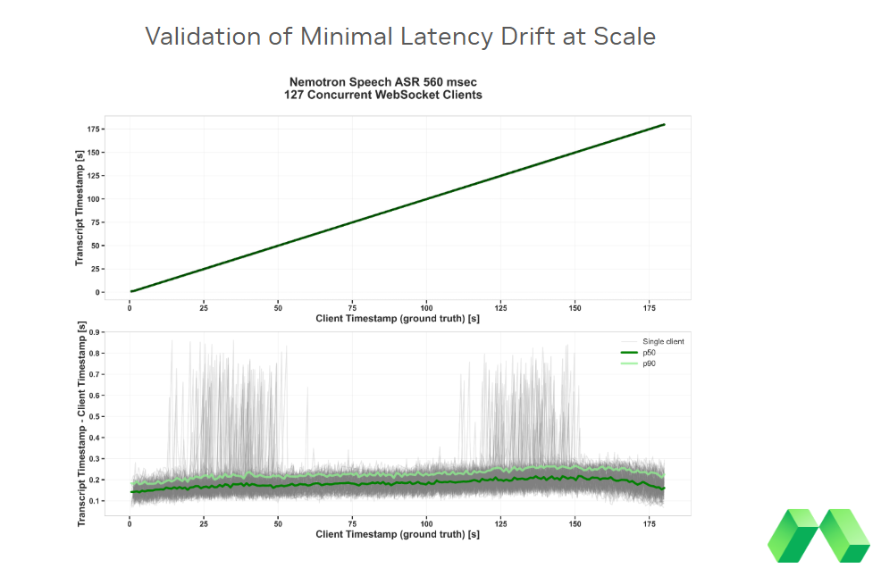
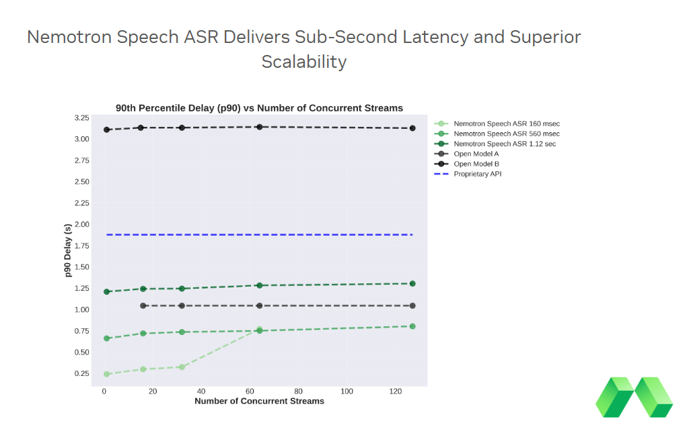

# Scaling Real-Time Voice Agents with Cache-Aware Streaming ASR

In voice AI interactions, we have long been trapped by a familiar trade-off: speed versus accuracy. Traditionally, real-time Automatic Speech Recognition (ASR) relies on buffered inference; a workaround where the system repeatedly re-processes overlapping audio windows to maintain context. It is the computational equivalent of re-reading the last few pages of a book every time you turn the page.
[NVIDIA Nemotron Speech ASR,](https://huggingface.co/nvidia/nemotron-speech-streaming-en-0.6b) a new, open model built specifically for real-time voice agents, breaks this cycle. Built on the FastConformer architecture with 8x downsampling, it introduces cache-aware technology to process only new audio "deltas." By reusing past computations rather than re-calculating them, it achieves up to 3x higher efficiency than traditional buffered systems.

In this post, we’ll explore how cache-aware architecture redefines the limits of real-time voice agents, and show real-world results from [Daily](https://www.daily.co/) and [Modal](https://modal.com/) for high-concurrency, low-latency voice agent workloads.

## The Challenge: Why Streaming ASR Breaks at Scale

Most systems labeled as “streaming ASR” were never designed for true real-time interaction at scale. The [Nemotron Speech](https://huggingface.co/collections/nvidia/nemotron-speech) collection—part of the [NVIDIA Nemotron family of open models](https://huggingface.co/nvidia/collections?search=nemotron)—enables developers to plug speech into custom agentic workflows.

**Buffered Inference is Not Real Streaming**

In many production systems, streaming is implemented using buffered inference. Audio is processed in sliding windows, and each new window overlaps with the previous one to preserve context. While this produces correct transcripts, it is fundamentally inefficient.

The model repeatedly reprocesses audio it has already seen, sometimes several times over, just to maintain continuity.

**Overlapping Windows Waste Compute**

This overlap means redundant computation at every step:

- The same audio frames are re-encoded
- The same attention context is recomputed
- GPU work scales faster than the actual audio stream

At low concurrency, this inefficiency may be tolerable. At scale, it becomes expensive and fragile.

**Latency Drift Breaks Conversational Agents**

As the number of concurrent streams increases, buffered systems often hit a scaling cliff. Latency begins to drift, and responses arrive later and later relative to spoken audio.

This drift is not a scheduling issue but a hardware resource problem. Because buffered inference repeatedly recomputes overlapping context, GPU memory fills with redundant activations and intermediate states. As memory pressure increases, the system becomes increasingly constrained, forcing slower execution, reduced batching efficiency, or outright throttling under load.

For conversational agents, this is fatal, even small delays disrupt downstream tasks such as turn-taking and interruption handling, making interactions feel unnatural. Over time, the system lags so far behind real speech that it can no longer support real-time dialogue—or it fails to scale at all when strict latency thresholds must be maintained.

This is the core limitation of legacy streaming ASR: it works in isolation, but breaks down under the computational and latency pressures of real-world, multi-user systems.

## The Solution: Cache-Aware Streaming ASR for Lower Latency, Linear Scale, and Predictable Cost

Nemotron Speech ASR introduces a next-generation streaming architecture that replaces the buffered inference models of legacy systems. Its cache-aware design enables real-time, high concurrency voice agents with stable latency, linear scaling, and significantly higher GPU throughput—without compromising accuracy or robustness.

**Key Benefits**

- **Lower end-to-end latency:** Reduces ASR processing time and redundant computation, minimizing end-to-end latency across voice agent pipelines with LLM reasoning and text-to-speech (TTS).
- **Efficient high concurrency:** Maintains near flat latency, even as concurrency increases by up to 3x, avoiding the rapid degradation seen in buffered systems. In practice, latency grows sublinearly and does not meaningfully budge until concurrency is significantly higher.
- **Linear memory scaling**: Cache-aware streaming prevents memory blow-ups enabling predictable performance and stable batching.
- **Higher GPU efficiency, lower cost**: Maximizes parallel stream throughput per GPU, reducing overall cost per stream.

### Inside Nemotron Speech ASR: FastConformer and 8x Downsampling

Nemotron Speech ASR is built on the FastConformer RNNT architecture, similar to [previous NVIDIA Parakeet ASR models](https://developer.nvidia.com/blog/nvidia-speech-ai-models-deliver-industry-leading-accuracy-and-performance/), optimized end-to-end for streaming inference.

A key innovation is 8x downsampling using depth-wise separable convolutional subsampling. Compared to traditional 4x systems, the encoder processes significantly fewer tokens per second, reducing VRAM footprint and increasing throughput across GPUs.

**Key Engineering Specs**

- **Architecture:** FastConformer with 24 encoder layers and RNNT decoder
- **Parameters:** 600M, optimized for high-throughput NVIDIA GPUs
- **Input:** 16 kHz streaming audio
- **Output:** Streaming English text with punctuation and capitalization
- **Dynamic, runtime-configurable latency modes:** 80ms, 160ms, 560ms, 1.12s (no retraining required)

### How Cache-Aware Streaming Works

Instead of re-encoding overlapping audio windows, Nemotron Speech ASR maintains an internal cache of encoder representations across all self-attention and convolution layers. When new audio arrives, the model updates this cached state rather than recomputing the previous context.

Each audio frame is processed exactly once without overlap or redundancy.

This design eliminates the two biggest problems of buffering inference:

- Wasted computation from reprocessing the same audio
- Latency drift as concurrent streams increase

The result is predictable end-to-end latency and linear scaling, even under heavy load

*Figure 1.: Cache-Aware Streaming Pipeline: The streaming ASR architecture utilizing a Cache Aware Conformer Encoder and a context manager to maintain encoder states without redundant computation.*

*Figure 2: Prediction Chunking and Audio Buffer: Detailed view of the audio buffer logic, demonstrating how prediction chunks and lookahead frames are processed in successive steps to ensure predictable memory behavior.*

For more details, check out the [paper](./2312.17279v3.pdf).

## Results: Throughput, Accuracy, and Speed at Scale

**Throughput That Holds Under Load**

The architectural efficiencies of cache-aware streaming translate directly into significant throughput gains. On the [NVIDIA H100](https://www.nvidia.com/en-us/data-center/h100/), Nemotron Speech ASR supports 560 concurrent streams at a 320ms chunk size, a 3x improvement over the baseline (180-streams). Similar gains are observed across the stack: the [NVIDIA RTX A5000](https://www.nvidia.com/en-us/products/workstations/rtx-5000/) delivers over 5x higher concurrency, while the [NVIDIA DGX B200](https://www.nvidia.com/en-us/data-center/dgx-b200/) provides up to a 2x throughput across 160ms and 320ms configurations.

Crucially, these benchmarks validate the system’s stability, maintaining zero latency drift even when pushed to peak capacity, enabled by bounded memory growth and cache reuse rather than repeated computation.

*Figure 3: Throughput expansion on NVIDIA H100, showing a 3x increase in concurrent supported streams at a 320ms chunk size compared to previous baselines.*

These results highlight why demos and proofs of concept should also account for scale and cost, ensuring low latency holds at target workloads and supports a sustainable business case.

**Accuracy Where It Counts: Latency-WER Tradeoffs**

Most ASR leaderboards evaluate models in offline mode, which hides the real-world cost of low latency. In streaming ASR, accuracy and latency are inseparable.

Nemotron Speech ASR provides dynamic runtime flexibility, allowing developers to choose the right operating point at inference time—not during training.

A chunk latency increases from 0.16s to 0.56s, the model captures additional phonetic context, reducing WER from 7.84% to 7.22%, while maintaining real-time responsiveness.

*Figure 4: Nemotron Speech ASR consistently outperforms CTC baseline (light green). Increased chunk latency improves WER by capturing richer phonetic context.*

**Fastest Time-To-FInal Transcription**

Nemotron Speech ASR also delivers industry-leading time-to-final transcription across both local and API-based alternatives:

- [Nemotron Speech ASR](https://huggingface.co/nvidia/nemotron-speech-streaming-en-0.6b): 24ms (median)
- Alternative (local, NVIDIA L40 GPU): 90ms
- Alternative models (API-based): 200ms+

Critically, finalization time remains stable even for long utterances—an essential property for real-time agents.

## Real-World Validation

### Modal: Validating Minimal Latency Drift at Scale

In collaboration with Modal, Nemotron Speech ASR was evaluated using asynchronous WebSocket streaming to measure latency stability at scale.

Evaluation setup:

- ASR: [Nemotron Speech ASR](https://huggingface.co/nvidia/nemotron-speech-streaming-en-0.6b)
- Serving Configuration: 560ms latency mode on an NVIDIA H100 GPU
- Load: 127 concurrent WebSocket clients
- Duration: 3-minute continuous stream

*Figure 5: Aggregate ASR timing analysis while running 127 concurrent WebSocket clients demonstrating perfectly linear timestamp synchronization and a stable median delay of 182ms, validating minimal latency drift at scale.*

At 127 simultaneous clients, Nemotron Speech ASR maintained stable end-to-end latency with minimal drift during a three-minute stream (Figure 5.). For voice agents, this difference is decisive. Even a few seconds a lag breaks turn-taking and renders interruption handling impossible.

As shown below, Nemotron Speech ASR achieves a level of efficiency previously thought impossible in real-time voice AI. The 160ms latency setting showcases the model's raw speed, delivering the fastest 'time-to-final' transcription available for high-stakes, real-time interactions.

What makes this architecture truly revolutionary is its intelligent resource management. When set to 160 ms latency, it pushes the absolute boundaries of hardware concurrency, but Nemotron has the unique flexibility to shift into high-capacity modes (560ms or 1.12s latency) that 'flatten the curve' entirely. This ensures that even at massive enterprise scale, users experience zero-drift, human-like responsiveness that proprietary APIs simply cannot sustain.

*Figure 6: Comparing real-world scaling of Nemotron ASR deployed on Modal to other open streaming ASR inference engines deployed on Modal and a proprietary API.*

### Daily: End-To-End Voice Agent Performance

Daily builds real-time audio and video infrastructure for developers creating voice-first and multimodal applications—from AI meeting assistants and customer support agents to real-time collaboration tools. For Daily’s users, predictable, low-latency speech pipelines are critical: delays or jitter directly translate into unnatural conversations and poor user experience.

To evaluate real-world performance, Daily integrated Nemotron Speech ASR into a full production-style voice agent pipeline consisting of:

- ASR: [Nemotron Speech ASR](https://huggingface.co/nvidia/nemotron-speech-streaming-en-0.6b)
- Brain: [Nemotron 3 Nano 30B](https://huggingface.co/nvidia/NVIDIA-Nemotron-3-Nano-30B-A3B-BF16)
- Voice: [Magpie TTS (multilingual)](https://huggingface.co/nvidia/magpie_tts_multilingual_357m) with 7 languages and 5 voices.
- Orchestration Library: [Pipecat by Daily](https://www.pipecat.ai/)
- Platforms: Modal, [DGX Spark](https://marketplace.nvidia.com/en-us/enterprise/personal-ai-supercomputers/dgx-spark/), [RTX 5090](https://www.nvidia.com/en-us/geforce/graphics-cards/50-series/rtx-5090/)

In this setup, Nemotron Speech ASR achieved a median time to final transcription of just 24ms, independent of utterance length. Long audio segments finalized as quickly as short ones—an essential property for interactive agents where users may speak unpredictably.

End-to-end, the full voice-to-voice loop completed in under 900ms for local deployment. This enables natural, turn-based conversations with stable, predictable latency, even under sustained interaction — exactly the behavior Daily’s developers need to build responsive, production-grade voice agents their users can trust.

## Conclusion: A New Baseline for Real-Time Voice Agents

Most ASR systems were originally designed for offline transcription and later adopted for streaming use cases. As these legacy approaches are pushed into high-concurrency, their limitations become clear, surfacing latency drift, rising infrastructure costs, and degraded user experiences.

Voice agents place fundamentally different demands on speech recognition. Streaming and real-time interaction can no longer be afterthoughts; they must be treated as first-class design goals. Meeting the complexity of voice-first applications requires ASR architectures that are purpose-built for low latency, scalability, and sustained performance under load.

Cache-aware streaming changes this foundation.

With Nemotron Speech ASR, voice agents no longer need to trade speed for accuracy or scalability. By eliminating redundant computation and enabling predictable, linear scaling, the model delivers sub-100ms responsiveness, stable latency under high concurrency, and production-ready performance at scale.

Nemotron Speech ASR establishes a new baseline for real-time, voice-first AI.

#### Next Steps

- Clone and run [Nemotron Speech ASR on Hugging Face](https://huggingface.co/spaces/nvidia/nemotron-speech-streaming-en-0.6b)
- Enable cache-aware streaming inference with [NVIDIA NeMo](https://github.com/NVIDIA-NeMo/NeMo/tree/r2.6.0)
- Deploy the Nemotron Speech ASR endpoint on [Modal](https://github.com/modal-projects/modal-nvidia-asr)
- Build local voice agent using [Daily’s framework](https://github.com/pipecat-ai/nemotron-january-2026)
